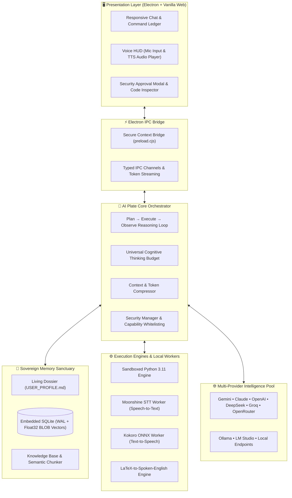

<p align="center">
  
</p>

# AI Plate — Open Power
### *Universal Sovereign AI Agent Harness & Genius Butler*

[](LICENSE)
[](https://www.typescriptlang.org/)
[](https://www.electronjs.org/)
[](https://www.sqlite.org/)
[](https://github.com/)

[Visit the AI Plate website](https://ai-plate.typobunch.com/) · [Download the Windows release](https://github.com/Typo-Bunch/AI-Plate/releases/tag/v1.0.0-rc.1)

## Install on Windows

Install the Windows x64 desktop app with one command. No Git, Node.js, or source build is required.

**PowerShell:**

```powershell
irm https://ai-plate.typobunch.com/install.ps1 | iex
```

**Git Bash on Windows:**

```bash
curl -fsSL https://ai-plate.typobunch.com/install.sh | bash
```

Both commands download the pinned `v1.0.0-rc.1` installer from GitHub Releases, verify its SHA-256 checksum, and open the setup wizard. Follow the wizard, launch AI Plate, and configure your AI provider in Settings.

These scripts support Windows x64 only; macOS, Linux, and WSL are not supported. They install the desktop app, not a separate CLI application.

You can inspect the [PowerShell script](https://ai-plate.typobunch.com/install.ps1) or [Bash script](https://ai-plate.typobunch.com/install.sh) before running it, or download the `.exe` directly from the [release page](https://github.com/Typo-Bunch/AI-Plate/releases/tag/v1.0.0-rc.1).

---

## 🌟 Manifesto: Why AI Plate?

> **True intelligence belongs to everyone.**  
> We believe advanced AI should not be locked behind walled gardens, opaque telemetry, or restrictive proprietary clients. **AI Plate** was engineered on a single foundational premise: **Open Power to All**.

AI Plate is not merely an API wrapper or a basic chat UI. It is an **autonomous, sovereign genius butler** living directly in your local environment. It is designed to place world-class reasoning, multi-modal voice processing, sandboxed code execution, persistent memory, and document synthesis entirely at your command — with zero vendor lock-in.

Whether you rely on cutting-edge cloud models (**Anthropic Claude 3.7**, **OpenAI GPT-4o / o3-mini**, **Google Gemini 2.5 / 3.5**, **DeepSeek R1**, **Groq**, **OpenRouter**) or completely offline local engines (**Ollama**, **LM Studio**, **vLLM**), AI Plate adapts to your hardware and your rules.

> [!NOTE]
> **Tested & Battle-Hardened**: The setup is robust and thoroughly tested out of the box with **Google Gemini 3.5** for the AI provider (reasoning & orchestration) and **Liquid / LFM 2.5** (`liquid/lfm-2.5-embedding-350m:free`) from **OpenRouter** for embedding (vector RAG & persistent memory).

---

## 🎩 Meet Your Sovereign Butler

Your Butler is always ready to receive orders. Far beyond a standard chatbot, it operates with stateful autonomy:

- 👤 **Sovereign Personal Dossier (`USER_PROFILE.md`)**: Automatically observes your preferences, ongoing projects, communication demeanor, and habits into a transparent, human-readable dossier stored in your local sanctuary.
- 🧠 **Dynamic Generative Reflection**: Continuously scores and reflects upon interactions (Importance 1–10) to anticipate your intent without repetitive prompting.
- 🗣️ **Local Hands-Free Voice**: Speak naturally and listen without latency or cloud surveillance using embedded **Moonshine STT** and **Kokoro ONNX TTS**.
- 🛠️ **Plan → Execute → Observe Reasoning Loop**: Self-corrects, verifies tool outputs, executes scripts, and queries knowledge before crafting final deliverables.
- 🛡️ **Human-in-the-Loop Governance**: High-risk actions (file modifications, shell commands, web interactions) require your explicit approval with interactive code diffs.

---

## 🚀 Key Features

| Subsystem | Capabilities |
| :--- | :--- |
| **Universal Model Orchestration** | Native integration with Gemini, OpenRouter, OpenAI, Anthropic, Groq, DeepSeek, and Ollama. Dynamic plug-and-play support for any OpenAI-compatible API (Together AI, LM Studio, vLLM). Setup is robust and tested with **Gemini 3.5** as the AI provider. |
| **Cognitive Thinking Depth** | Universal thinking budget knobs (`off`, `low`, `medium`, `high`, `max`) enabling deep chain-of-thought reasoning across all providers. |
| **Local Speech-to-Text (STT)** | Offline, fast transcription powered by **Moonshine AI** running through a dedicated local Python worker. |
| **Local Text-to-Speech (TTS)** | Ultra-natural on-device voice synthesis via **Kokoro ONNX** with mathematical LaTeX parsing (spoken algebraic equations). |
| **High-Speed Vector RAG** | Native SQLite vector store powered by `better-sqlite3` with IEEE 754 Float32 binary BLOB embeddings, WAL mode, and automated TTL pruning. Robust and tested with **Liquid / LFM 2.5** from OpenRouter for embedding. |
| **Sandboxed Code Execution** | Isolated bundled Python 3.11 engine for real-time mathematical modeling, statistical analysis, and script execution. |
| **Intelligent Context Compression** | Dynamic sliding-window token management, tool output summarization, and RAG deduplication preventing context overflow. |
| **Modular Extensibility** | Hot-reloadable **Custom Skills** (`SKILL.md`), third-party **Connectors**, and dynamic **Tool Plugins**. |

---

## 🏛️ System Architecture



---

## 📂 Project Structure

```text
ai_plate/
├── core/                         # Central Agent Brain & Subsystems
│   ├── orchestrator.ts           # Plan-Execute-Observe reasoning loop
│   ├── ai-provider.ts            # Universal provider abstraction
│   ├── database.ts               # SQLite WAL manager & Float32 BLOB vector math
│   ├── personal-memory.ts        # 3-Tier living dossier engine (USER_PROFILE.md)
│   ├── vector-store.ts           # Semantic document storage & cosine retrieval
│   ├── context-compressor.ts     # Intelligent token budget pruning
│   ├── security-manager.ts       # Capability governance & approval workflow
│   ├── python-engine.ts          # Sandboxed Python runtime manager
│   ├── skills-manager.ts         # Custom SKILL.md directives & keyword filters
│   ├── stt-service.ts            # Local Moonshine voice transcription bridge
│   ├── tts-service.ts            # Local Kokoro ONNX voice synthesizer bridge
│   └── latex-speech.ts           # Math formula to natural speech translator
├── electron/                     # Desktop Application Harness
│   ├── main.ts                   # Electron lifecycle & native window management
│   ├── preload.cjs               # Sandboxed IPC bridge
│   └── ipc-bridge.ts             # Typed event dispatchers & audio streams
├── providers/                    # Provider Adapters (Gemini, Claude, OpenAI, etc.)
├── plugins/                      # Built-in & installed tool plugins
├── connectors/                   # External service & database connectors
├── skills-sample/                # Example custom skills in markdown format
├── scripts/                      # Standalone Python workers & setup utilities
│   ├── kokoro-worker.py          # On-device Kokoro TTS ONNX synthesis worker
│   ├── moonshine-worker.py       # On-device Moonshine STT transcription worker
│   └── setup-bundled-python.js   # Automated runtime environment bootstrap
├── ui/                           # Glassmorphic Cyberpunk/Modern Desktop UI
│   ├── index.html                # App shell & layout
│   ├── style.css                 # Vanilla CSS design system & micro-animations
│   └── app.js                    # Reactive frontend controller & audio visualizer
├── USER_PROFILE.md               # Your sovereign personal dossier (on-device)
├── config.yaml                   # Central application configuration
├── electron-builder.json         # Cross-platform installer packaging config
└── package.json                  # Dependencies & scripts
```

---

## ⚡ Quick Start & Setup Guide (Any PC: Windows, macOS, Linux)

Follow these step-by-step instructions to get **AI Plate** running from scratch on any computer.

### 📋 System Prerequisites

Ensure you have the following installed on your system before proceeding:

1. **Node.js**: `v20.0.0` or higher (`v22+ LTS` recommended)  
   👉 [Download Node.js](https://nodejs.org/) (Includes `npm` and `npx`)
   - *Verify in terminal:* `node -v` and `npm -v`
2. **Git**: Distributed version control  
   👉 [Download Git](https://git-scm.com/)
   - *Verify in terminal:* `git --version`
3. *(Optional)* **Python**: `3.10` to `3.12` installed on host system if you do not use the bundled runtime.
4. **Hardware recommendations**:
   - Minimum: 4 GB RAM, dual-core CPU (for cloud-based providers).
   - Recommended: 8 GB+ RAM, 4-core CPU (if running local Kokoro TTS & Moonshine STT).
   - For local LLMs (Ollama / LM Studio): 16 GB+ RAM or dedicated GPU (8 GB+ VRAM).

---

### 🛠️ Step-by-Step Installation

#### Step 1: Clone the Repository
Open your terminal (PowerShell on Windows, Terminal on macOS/Linux) and run:

```bash
git clone https://github.com/your-username/ai-plate.git
cd ai-plate
```

---

#### Step 2: Install Dependencies
Install all project dependencies with `npm`:

```bash
npm install
```

> [!TIP]
> **Zero Compilation Needed**: AI Plate comes pre-configured with a project-level `.npmrc` (`ignore-scripts=true`) and precompiled native binaries for `better-sqlite3`. You do **not** need Visual Studio C++ Build Tools or `node-gyp` installed on Windows. Everything installs in seconds!

---

#### Step 3: Configure Environment Variables (`.env`)
Create your local `.env` configuration file from the provided template:

- **Windows (PowerShell):**
  ```powershell
  Copy-Item .env.example .env
  ```
- **Windows (Command Prompt):**
  ```cmd
  copy .env.example .env
  ```
- **macOS / Linux:**
  ```bash
  cp .env.example .env
  ```

Open the newly created `.env` file in your favorite text editor (e.g. VS Code, Notepad, Nano) and add an API key for your preferred provider:

```ini
# --- Select at least one cloud provider (or skip for 100% offline local use) ---
GEMINI_API_KEY=your_gemini_api_key_here
OPENROUTER_API_KEY=your_openrouter_api_key_here
ANTHROPIC_API_KEY=your_anthropic_api_key_here
OPENAI_API_KEY=your_openai_api_key_here
GROQ_API_KEY=your_groq_api_key_here
DEEPSEEK_API_KEY=your_deepseek_api_key_here
```

> [!NOTE]
> **Tested Stack & Free Tier Recommendation**:
> - **Robust & Tested Default**: The setup is robust and tested with **Google Gemini 3.5** (`gemini-3.5-flash-lite`, `gemini-3.5-flash`) for the AI provider and **Liquid / LFM 2.5** (`liquid/lfm-2.5-embedding-350m:free`) from **OpenRouter** for embedding.
> - **Google Gemini** provides generous free-tier API quotas (`gemini-3.5-flash-lite`, `gemini-2.5-flash-lite`, `gemini-2.0-flash`).
> - **OpenRouter** provides top free community models (Liquid / LFM 2.5 Free, DeepSeek R1 Free, Llama 3.3 70B Free).
> - **Ollama / LM Studio**: 100% Free and requires **no API key**.

---

#### Step 4: Configure Application Settings (`config.yaml`)
Create your application configuration file:

- **Windows (PowerShell):**
  ```powershell
  Copy-Item config.example.yaml config.yaml
  ```
- **Windows (Command Prompt):**
  ```cmd
  copy config.example.yaml config.yaml
  ```
- **macOS / Linux:**
  ```bash
  cp config.example.yaml config.yaml
  ```

*(The default `config.yaml` is pre-tuned for high performance and works immediately out of the box. The setup is robust and tested with **Gemini 3.5** as the AI provider and **Liquid / LFM 2.5** from **OpenRouter** for embedding).*

---

#### Step 5: (Recommended) Setup Local Voice & Sandboxed Python
To activate the Butler's offline speech synthesis (**Kokoro ONNX**), voice recognition (**Moonshine STT**), and sandboxed execution engine:

```bash
npm run setup:python
```

This automated script bootstraps an isolated Python environment under `runtime/python/` with the required ONNX and acoustic model weights. It does not tamper with or pollute your system's global Python installation.

---

#### Step 6: Compile the Application
Compile the TypeScript source code and package the Electron preload bridge:

```bash
npm run build
```
You should see:  
`✔ Build completed successfully! TypeScript compiled to dist/`

---

#### Step 7: Launch Your Butler!

Run in **Live Development Mode**:
```bash
npm run dev
```

Or run directly in **Electron Standard Mode**:
```bash
npm start
```

The AI Plate Butler desktop application will launch immediately! 🚀

---

### ❓ Troubleshooting & Common Questions

<details>
<summary><b>1. What if <code>npm install</code> fails with a <code>node-gyp rebuild</code> or Visual Studio error?</b></summary>

If you receive an error mentioning `find VS` or `Could not find any Visual Studio installation to use`:
1. Ensure the [.npmrc](.npmrc) file exists in your project root with the line:
   ```ini
   ignore-scripts=true
   ```
2. Or run the install command with the flag directly:
   ```bash
   npm install --ignore-scripts
   ```
3. Re-run `npm run build`.
</details>

<details>
<summary><b>2. How can I run AI Plate 100% Free & Completely Offline?</b></summary>

1. Download and run [Ollama](https://ollama.com/) or [LM Studio](https://lmstudio.ai/).
2. Pull a local model (e.g., `ollama pull llama3.3` or `ollama pull deepseek-r1`).
3. In [config.yaml](config.yaml), set:
   ```yaml
   provider:
     active: "ollama"
     models:
       ollama: "llama3.3"
   ```
4. You can now chat, execute code, and query documents without internet access!
</details>

<details>
<summary><b>3. Microphone / Voice Input is not responding?</b></summary>

- On **Windows**: Go to *Settings → Privacy & security → Microphone* and ensure desktop apps have access.
- On **macOS**: Go to *System Settings → Privacy & Security → Microphone* and permit Electron / Terminal.
- On **Linux**: Verify your PulseAudio / ALSA capture device is default.
</details>

<details>
<summary><b>4. How do I clear or reset the Butler's memory?</b></summary>

- To reset personal memory facts, delete or edit `USER_PROFILE.md`.
- To reset the vector database and conversation history, delete `agent_data.db` (it will be regenerated automatically on the next launch).
</details>


---

## ⚙️ Configuration Knobs (`config.yaml`)

You have granular control over every aspect of the Butler through [config.yaml](config.yaml). The setup is robust and tested with **Gemini 3.5 for the AI provider** and **Liquid / LFM 2.5 from OpenRouter for embedding**:

```yaml
# Active reasoning provider (robustly tested with Gemini 3.5 as AI provider)
provider:
  active: "gemini" # Options: gemini | openrouter | openai | anthropic | groq | deepseek | ollama

# Universal Cognitive Thinking Depth
thinking:
  level: "high" # Options: off | low | medium | high | max

# Vector Embeddings (RAG & Long-Term Memory - tested with Liquid / LFM 2.5 from OpenRouter for embedding)
embedding:
  provider: "openrouter"
  model: "liquid/lfm-2.5-embedding-350m:free" # Fast, high-dimensional free embeddings

# Autonomous Scratchpad
workspace:
  sandbox_dir: ".sandbox"      # Ephemeral directory for code runs
  artifacts_dir: "artifacts"   # Output directory for generated charts, tables, reports
```

### Adding Custom OpenAI-Compatible Endpoints
You can add unlimited local or enterprise cloud models under `custom_providers`:
```yaml
custom_providers:
  lmstudio:
    display_name: "LM Studio (Local)"
    driver: "openai-compatible"
    base_url: "http://localhost:1234/v1"
    default_model: "local-model"
```

---

## 🧩 Adding Custom Skills

Teach your Butler new capabilities by dropping markdown files into the `skills/` directory. Each skill uses clean YAML frontmatter:

```markdown
---
name: "Code Reviewer"
description: "Strict architectural and security review of pull requests"
triggers: ["review code", "audit", "find bugs"]
---

When invoked, inspect the target files for:
1. Memory leaks or unclosed database handles
2. Proper error boundaries and type safety
3. Adherence to clean architectural boundaries
```

The Butler uses **Smart Intent Filtering** to dynamically activate only the skills relevant to your prompt, conserving your token budget.

---

## 📦 Building Production Installers

Package AI Plate as a native desktop application with a single command:

```bash
# Compile TypeScript and bundle with Electron Builder
npm run dist

# Or create a standalone Windows NSIS installer
npm run dist:setup
```

Installers and portable packages are output to the `release/` directory.

---

## 🔒 Privacy & Sovereignty Commitment

1. **Your Data Stays With You**: All chat records, vector embeddings, SQLite tables, and your `USER_PROFILE.md` dossier remain 100% on your machine.
2. **No Proprietary Telemetry**: AI Plate does not transmit analytics, user telemetry, or behavior logs to external servers.
3. **Transparent Code Execution**: Every script executed by the agent runs in an isolated local directory with visible inputs and outputs.

---

## 🤝 Contributing

Contributions from the open-source community are what make Open Power possible! Whether it's adding connectors, optimizing embeddings, refining UI themes, or writing skills:

1. Fork the Project
2. Create your Feature Branch (`git checkout -b feature/AmazingFeature`)
3. Commit your Changes (`git commit -m 'Add AmazingFeature'`)
4. Push to the Branch (`git push origin feature/AmazingFeature`)
5. Open a Pull Request

---

## 📜 License

Distributed under the **MIT License**. See [`LICENSE`](LICENSE) for more details.

---

<p align="center">
  <b>Built for sovereignty. Engineered for capability. Powered by Open Intelligence.</b><br>
  <i>AI Plate — Open Power</i>
</p>

## Chat modes

Choose a mode beside the chat input. Each conversation remembers its selection across restarts; changing the mode affects the next message. Thinking level remains a separate setting.

- **Normal**: General conversation, web search, and knowledge retrieval.
- **Plan**: Read available files and research an implementation plan. Command execution and file changes are blocked by the backend.
- **Code**: Implement changes and run verification using enabled tools, subject to existing security checks.

Plan responses include **Implement this plan**, which switches the conversation to Code and submits the plan for implementation. Unknown plugin and connector tools are only available in Code mode. Normal is the default for new and existing conversations without a saved mode.
